# MatthewBeale_T2A2
[MatthewBeale_T2A2 - Github repository link](https://github.com/mttble/T2A2-API-Webserver-Project)
# Table of Contents:
- [Installation Instructions](#installation-instructions)
- [R1 - Identification of the problem you are trying to solve by building this particular app.](#r1---identification-of-the-problem-you-are-trying-to-solve-by-building-this-particular-app)
- [R2 - Why is it a problem that needs solving?](#r2---why-is-it-a-problem-that-needs-solving)
- [R3 - Why have you chosen this database system. What are the drawbacks compared to others?](#r3---why-have-you-chosen-this-database-system-what-are-the-drawbacks-compared-to-others)
- [R4 - Identify and discuss the key functionalities and benefits of an ORM](#r4---identify-and-discuss-the-key-functionalities-and-benefits-of-an-orm)
- [R5 - Document all endpoints for your API](#r5---document-all-endpoints-for-your-api)
- [R6 - An ERD for your app]
- [R7 - Detail any third party services that your app will use]
- [R8 - Describe your projects models in terms of the relationships they have with each other]
- [R9 - Discuss the database relations to be implemented in your application]
- [R10 - Describe the way tasks are allocated and tracked in your project]

------------------------------------------------

### **Installation Instructions:**

#### **Open WSL command line and run the following commands:**
- Start PostgreSQL server with - `sudo service postgresql start`
- `psql`
- `create database electrify`

#### **Open a second WSL command line and run the following commands:**
- `python3 -m venv .venv`
- If virtual environment is not automatically activated run - `source .venv/bin/activate`
- `pip install -r requirements.txt`
- `flask run`
- `flask db create`
- `flask db seed`
- Open postman and use localhost:8080 as port 8080 is set as the default port in .flaskenv
------------------------------------
### **R1 - Identification of the problem you are trying to solve by building this particular app.**
I am building this particular app to address the inefficiency and disjointed nature of employee record keeping in large electrical companies. The problem at hand is the reliance on separate folders, files, and spreadsheets to store employee records within private computer networks. This fragmented approach makes it challenging to manage and retrieve contact information, license details, and course histories effectively.

By developing this app, I aim to provide streamlined solution for managing employee records. The app will offer a unified platform where businesses can store and access all relevant employee information in a structured and organised manner. It will eliminate the need for a diverse range of systems and manual record-keeping processes, ultimately improving efficiency and reducing errors in employee data management.

-----------------------------------

### **R2 - Why is it a problem that needs solving?**
The reliance on separate folders, files, and spreadsheets to store employee records within private computer networks poses several challenges and creates a problem that needs to be addressed. Here are the reasons why it is a problem that needs solving:

- **Inefficiency:** The current fragmented approach to employee record keeping leads to inefficiency in managing and retrieving information. It requires manual effort and time-consuming searches across various files and folders, hindering productivity and wasting valuable resources. Admin assistants may be familiar with locations of these files however project managers and new staff waste time working it all out.

- **Data Discrepancies:** When employee records are stored in multiple locations and formats, it increases the likelihood of data discrepancies and inconsistencies. Inaccurate or outdated information can lead to errors in decision-making, compliance issues, and difficulties in tracking license and course histories.

- **Lack of Centralisation:** Without a centralised system, accessing and updating employee records becomes complex. This lack of centralisation can result in duplication of efforts, difficulty in tracking changes, and limited visibility across the organisation. Currently employees cannot access or update their records without being in the office on the private network. Trying to access contact information of another employee is difficult and usually requires you to ask around for a phone number or email address.

- **Limited Collaboration:** The current approach inhibits collaboration and effective communication among employees and HR departments. Sharing and updating information becomes cumbersome, impeding the ability to ensure regulatory compliance and up to date contact information.

By solving these problems through the development of the app, we can streamline employee record keeping, improve data accuracy, enhance efficiency, and foster collaboration within large electrical companies.

--------------------------------------

### **R3 - Why have you chosen this database system. What are the drawbacks compared to others?**

I have chosen PostgreSQL as the database management system for this app due to its reliablity, scalability and suitability for managing structured data, which is crucial for employee record keeping. It is also widely adopted across many industries and is used by small to large and even enterprise organisations. It has a good reputation and a large community that maintains its relevance as a popular choice for developers.

It is important to compare PostgreSQL with other database management systems to better understand it's suitability.
#### **PostgreSQL drawbacks compared with MongoDB**

- **Schema Flexibility:** PostgreSQL's relational nature requires predefined schemas, which can be less flexible compared to MongoDB's schema-less approach. If your app deals with evolving or dynamic data structures, making frequent schema changes in PostgreSQL might be more cumbersome.

- **Schema Rigidity:** PostgreSQL follows a rigid schema structure, requiring predefined schemas and table relationships. This can be a limitation if your app deals with evolving or unstructured data, as you need to define and modify the schema in advance.

- **Performance Impact:** In certain scenarios with high read or write workloads, PostgreSQL's ACID-compliant nature and transactional integrity can introduce additional performance overhead. If your app requires extremely high throughput or real-time data processing, MongoDB's flexible document model may offer better performance.

#### **MongoDB drawbacks compared with PostgreSQL**
- **Data Redundancy:** MongoDB is a non-relational database management system and unlike PostgreSQL and other relational databases, MongoDB does not enforce strict data normalization, which can result in data redundancy and duplication. This can lead to increased storage requirements and potential data inconsistencies if updates are not performed carefully.

- **Lack of ACID Transactions:** MongoDB, being a NoSQL database, sacrifices ACID (Atomicity, Consistency, Isolation, Durability) properties in favor of high scalability and performance. This means that it may not guarantee strict consistency or transactional integrity in all scenarios. Unlike PostgreSQL which is ACID compliant.

- **Memory and Disk Requirements:** MongoDB's memory usage can be relatively high compared with PostgreSQL due to its caching mechanisms and indexes. Additionally, the disk space required for storing data can be larger than PostgreSQL.

PostgreSQL and MongoDB are both different database management systems. If your app primarily deals with structured data and requires strong data integrity, relational queries, and complex relationships between tables, PostgreSQL would be a suitable choice. On the other hand, if your app involves managing unstructured or rapidly evolving data, requires horizontal scalability, and prefers a flexible schema, MongoDB could be a better fit.

Sources:

https://www.educba.com/mongodb-vs-postgresql/

https://kinsta.com/blog/mongodb-vs-postgresql/#:~:text=A%20key%20feature%20that%20sets,two%20tables%20to%20each%20other.

https://fulcrum.rocks/blog/why-use-postgresql-database#:~:text=Postgres%20allows%20you%20to%20store,lot%20of%20supporters%20and%20critics.

---------------------------------------------------------------

### **R4 - Identify and discuss the key functionalities and benefits of an ORM**

Object Relational Mapping (ORM) is used in software development to bridge the gap between Object Oriented Programming (OOP) and relational databases. The ORM tool handles the translation between an object-oriented model and the relational database model. An ORM basically takes care of generating and executing the appropriate SQL queries based on high-level operations performed on objects, eliminating the need for developers to manually write complex and repetitive SQL queries.

some key functionalities of an ORM are:
-  **Mapping Objects to Tables:** An ORM maps object-oriented models to relational database tables.

- **CRUD Operations:** An ORM provides the ability to perform CRUD operations (Create, Read, Update, Delete) on the database using object-oriented syntax.

- **Relationship Mapping:** An ORM handles the relationship mapping between objects and tables. For example one-to-one, one-to-many, many-to-many relationships.

some of the key benefits of an ORM are:
-  **Mapping Objects to Tables:** This mapping allows developers to work with objects directly, eliminating the need to write low-level SQL queries manually.

- **CRUD Operations:** Developers can create, retrieve, update, and delete database records using familiar object-oriented programming techniques.

- **Relationship Mapping:** Developers can define and navigate relationships between objects, and the ORM takes care of maintaining referential integrity in the underlying database.

Other benefits include code portablility as the ORM abstracts away the specific details of the underlying database and allows the application to work with different databases without needing to change the code to much. It is designed to simplify database interactions for developers and abstracts away the complexities of the underlying database system.

--------------------------
### **R5 - Document all endpoints for your API**

### **1. /register**
- **HTTP Request Verb:** POST

- **Required data:** name, email, password, phone_number

- **Expected response Data:** Expected '201 CREATED' response with return of data excluding password and is_admin.

- **Authentication methods:** No authentication method required for new users to register as a user to the app. Bcrypt will hash the password and store the hashed password in the database.

- **Description:** Allows user to register. This information is stored in the database.

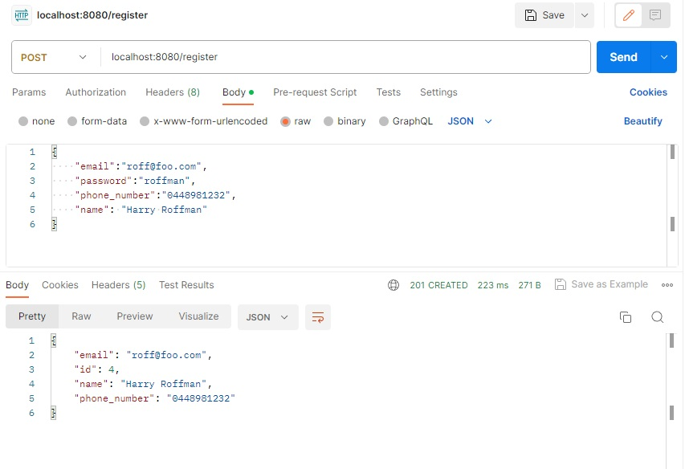

---------------------------------

### **2. /login**
- **HTTP Request Verb:** POST

- **Required data:** email, password

- **Expected response Data:** Expected '200 OK' response with return of user data and JWT token generation excluding password.

- **Authentication methods:** email, password

- **Description:** Allows user to login if email and password provided are matching in the database. It then generates a JWT token required for authorisation to enable user to use the app.

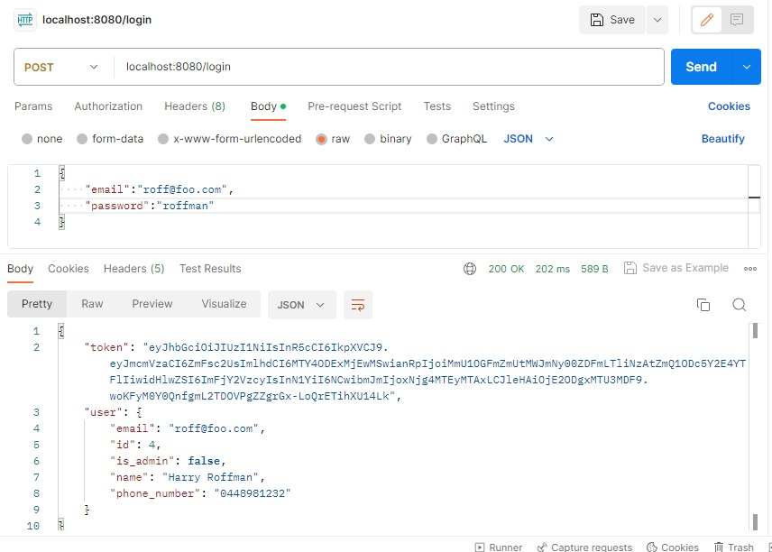

--------------------------------

### **3. /users**
- **HTTP Request Verb:** GET

- **Required data:** N/A

- **Expected response Data:** Expected '200 OK' response with return of all users data (excluding passwords).

- **Authentication methods:** Valid JWT token

- **Description:** Allows user to get all users information (handy for looking up work contact details of employees, checking users id or checking who is admin)

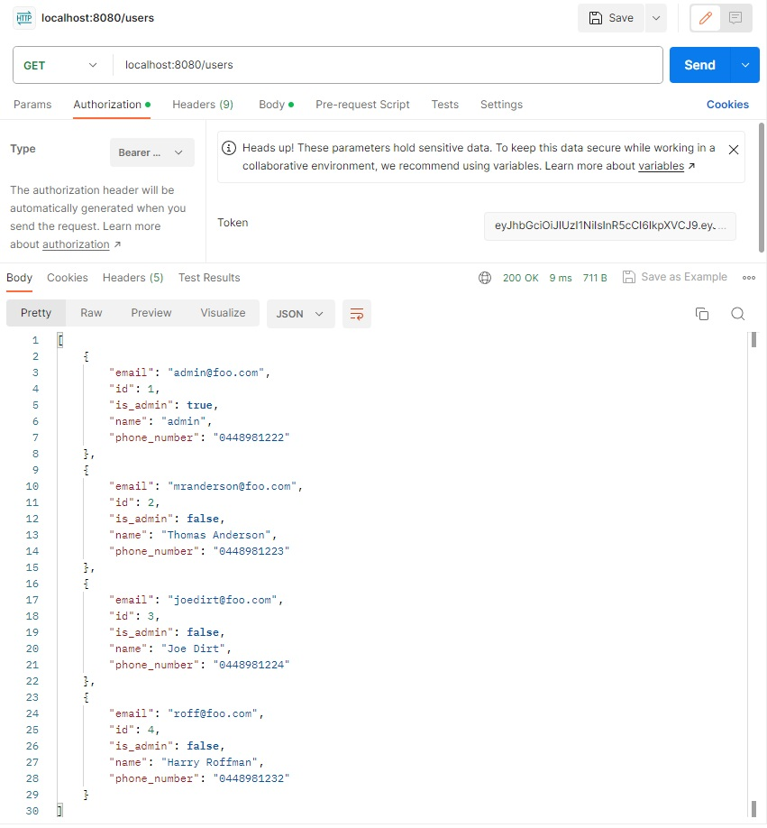

------------------------------------

### **4. /users/&lt;int:user_id&gt;**
- **HTTP Request Verb:** DELETE

- **Required data:** N/A

- **Expected response Data:** Expected '200 OK' and return of empty JSON response.

- **Authentication methods:** Valid JWT token, admin_required()

- **Description:** Allows an admin to delete a specific user (cascade deletes their associated records too).

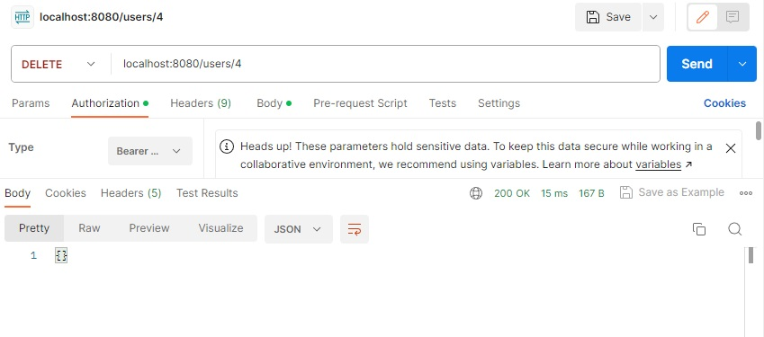

------------------------------------

### **5. /users/&lt;int:user_id&gt;**
- **HTTP Request Verb:** PUT, PATCH

- **Required data:** name, email, password, phone_number (none or any of these values can be updated)

- **Expected response Data:** Expected '200 OK' response with return of user data excluding password.

- **Authentication methods:** Valid JWT token. Checks if current_user_id (using get_jwt_identity()) == user_id they are trying to update or if they are an admin.

- **Description:** Allows a user to update their information or an admin to update any users information. This example shows user_id 5 Harry Roffman updating his phone number in the database.

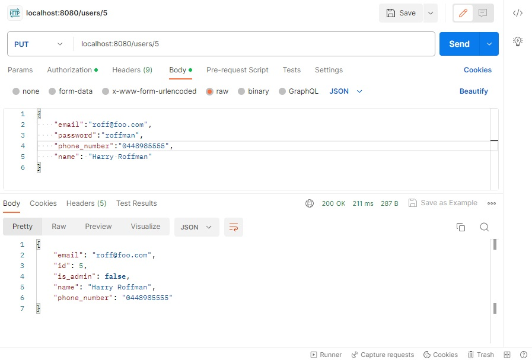

------------------------------------

### **6. /courses**
- **HTTP Request Verb:** GET

- **Required data:** N/A

- **Expected response Data:** Expected '200 OK' response with return of all courses

- **Authentication methods:** Valid JWT token

- **Description:** Allows users to get all courses

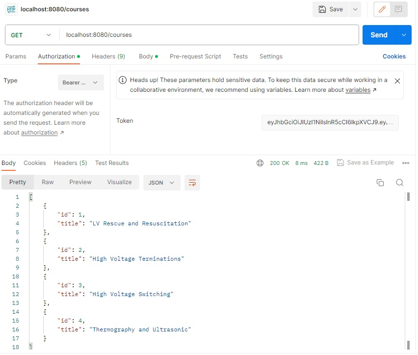

------------------------------------

### **7. /courses**
- **HTTP Request Verb:** POST

- **Required data:** title

- **Expected response Data:** Expected '201 CREATED' response with return of new course data

- **Authentication methods:** Valid JWT token, admin_required()

- **Description:** Allows an admin to add a new course to the courses table.

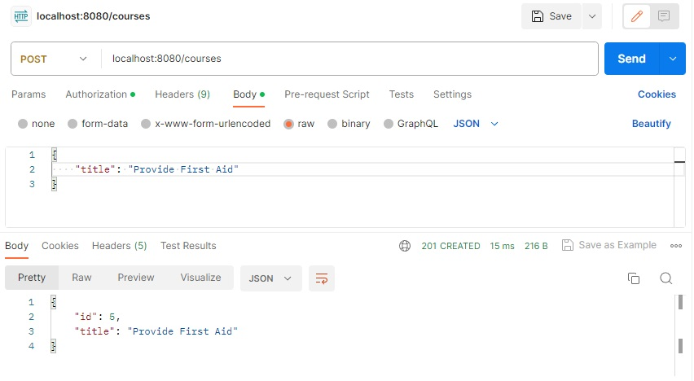

------------------------------------

### **8. /courses/&lt;int:course_id&gt;**
- **HTTP Request Verb:** DELETE

- **Required data:** N/A

- **Expected response Data:** Expected '200 OK' and return of empty JSON response.

- **Authentication methods:** Valid JWT token, admin_required()

- **Description:** Allows an admin to delete a course in the courses table.

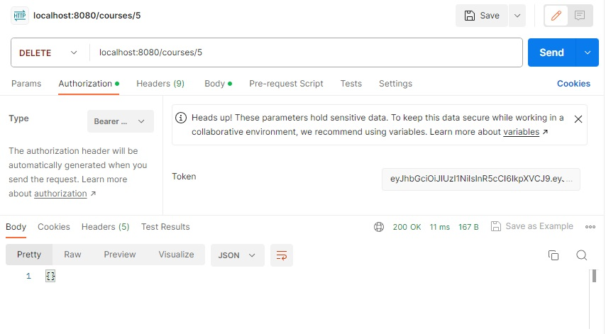

------------------------------------

### **9. /licences**
- **HTTP Request Verb:** GET

- **Required data:** N/A

- **Expected response Data:** Expected '200 OK' response with return of all licences

- **Authentication methods:** Valid JWT token

- **Description:** Allows users to get all licences

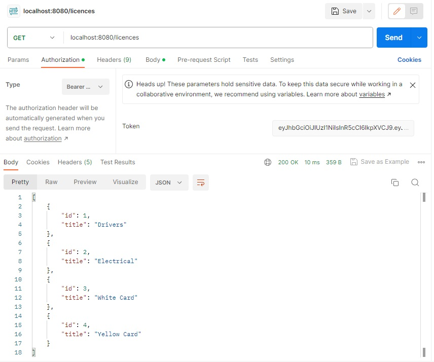

------------------------------------

### **10. /licences**
- **HTTP Request Verb:** POST

- **Required data:** title

- **Expected response Data:** Expected '201 CREATED' response with return of new licence data

- **Authentication methods:** Valid JWT token, admin_required()

- **Description:** Allows an admin to add a new licence to the licences table.

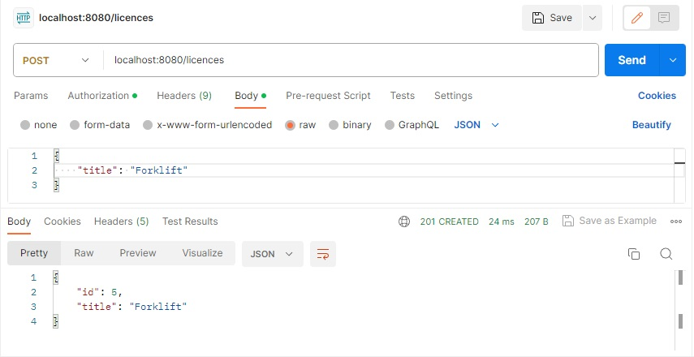

------------------------------------

### **11. /licences/&lt;int:licence_id&gt;**
- **HTTP Request Verb:** DELETE

- **Required data:** N/A

- **Expected response Data:** Expected '200 OK' and return of empty JSON response.

- **Authentication methods:** Valid JWT token, admin_required()

- **Description:** Allows an admin to delete a licence in the licences table.

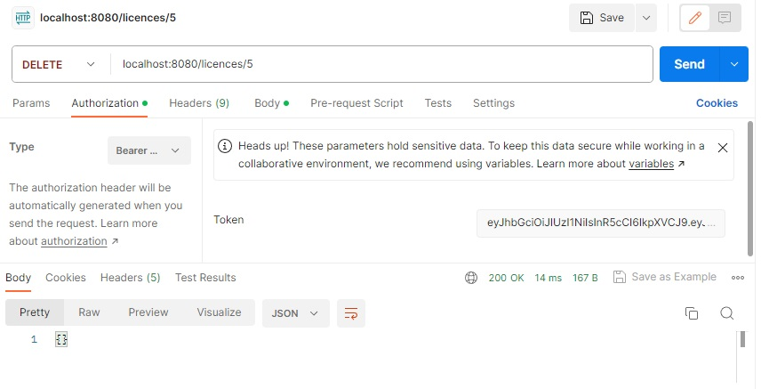

------------------------------------

### **12. /user_courses**
- **HTTP Request Verb:** GET

- **Required data:** N/A

- **Expected response Data:** Expected '200 OK' response with return of all users user_courses

- **Authentication methods:** Valid JWT token

- **Description:** Allows users to get all user_courses information associated with their id.

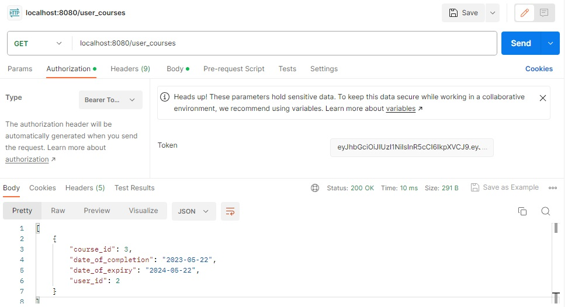

------------------------------------

### **13. /user_courses/users/all**
- **HTTP Request Verb:** GET

- **Required data:** N/A

- **Expected response Data:** Expected '200 OK' response with return of all user_courses

- **Authentication methods:** Valid JWT token, admin_required()

- **Description:** Allows admin to get all users user_courses information.

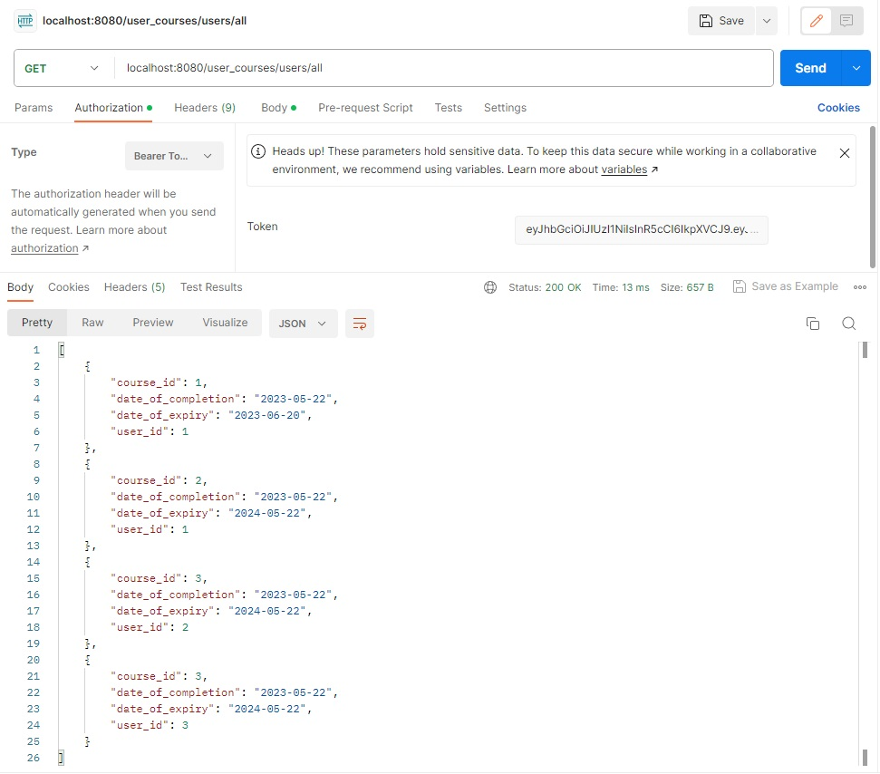

------------------------------------

### **14. /user_courses/users/&lt;int:user_id&gt;**
- **HTTP Request Verb:** GET

- **Required data:** N/A

- **Expected response Data:** Expected '200 OK' response with return of specific users user_courses

- **Authentication methods:** Valid JWT token, admin_required()

- **Description:** Allows admin to get specific users user_courses information.

------------------------------------

### **15. /user_courses**
- **HTTP Request Verb:** POST

- **Required data:** course_id, date_of_completion, date_of_expiry

- **Expected response Data:** Expected '201 CREATED' response with return of user_courses information

- **Authentication methods:** Valid JWT token

- **Description:** Allows users to add user_courses

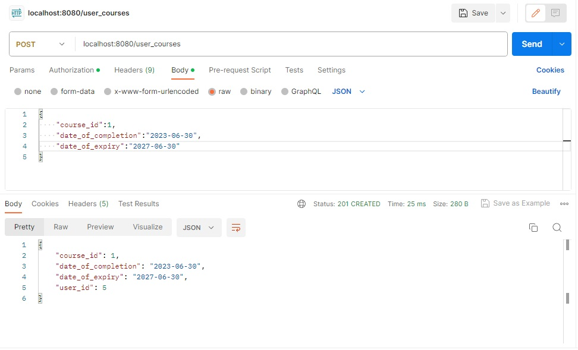

------------------------------------

### **16. /user_courses/&lt;int:course_id&gt;**
- **HTTP Request Verb:** PUT, PATCH

- **Required data:** date_of_completion, date_of_expiry (none or any of these values can be updated)

- **Expected response Data:** Expected '200 OK' response with return of user_courses information

- **Authentication methods:** Valid JWT token

- **Description:** Allows users to update their user_courses information

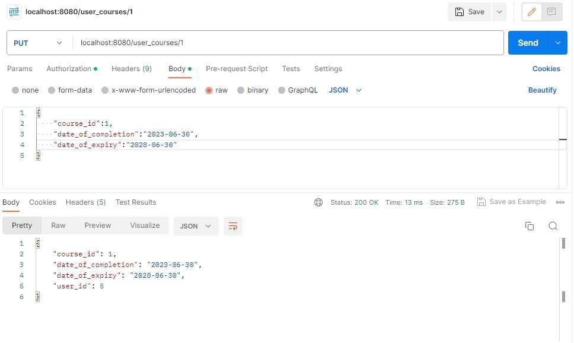

------------------------------------

### **17. /user_courses/user/&lt;int:user_id&gt;/course/&lt;int:course_id&gt;**
- **HTTP Request Verb:** PUT, PATCH

- **Required data:** date_of_completion, date_of_expiry (none or any of these values can be updated)

- **Expected response Data:** Expected '200 OK' response with return of user_courses information

- **Authentication methods:** Valid JWT token

- **Description:** Allows admin to update a users user_courses information

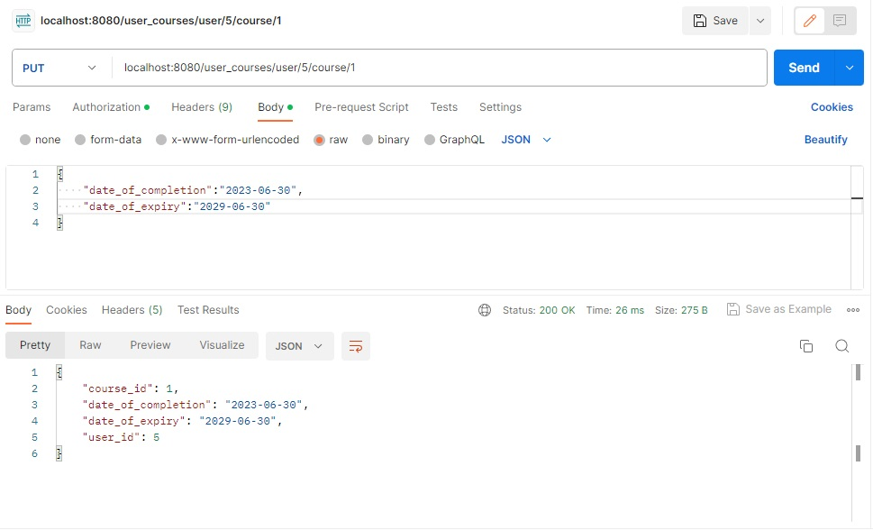

------------------------------------

### **18. /user_courses/&lt;int:course_id&gt;**
- **HTTP Request Verb:** DELETE

- **Required data:** N/A

- **Expected response Data:** Expected '200 OK' and return of empty JSON response.

- **Authentication methods:** Valid JWT token

- **Description:** Allows user to delete user_courses

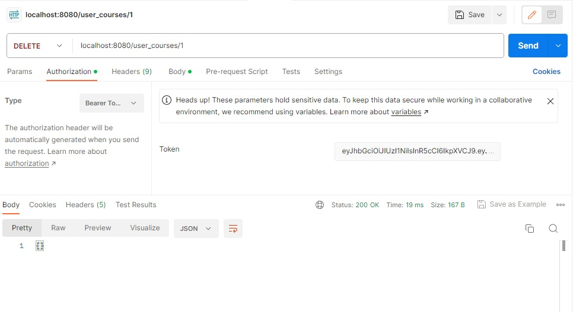

------------------------------------

### **19. /user_courses/user/&lt;int:user_id&gt;/course/&lt;int:course_id&gt;**
- **HTTP Request Verb:** DELETE

- **Required data:** N/A

- **Expected response Data:** Expected '200 OK' and return of empty JSON response.

- **Authentication methods:** Valid JWT token, admin_required()

- **Description:** Allows admin to delete a users user_courses

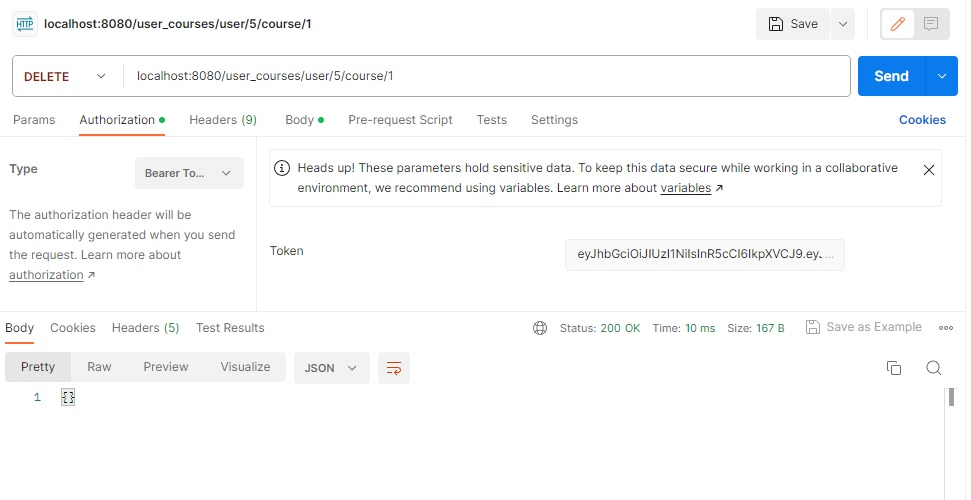